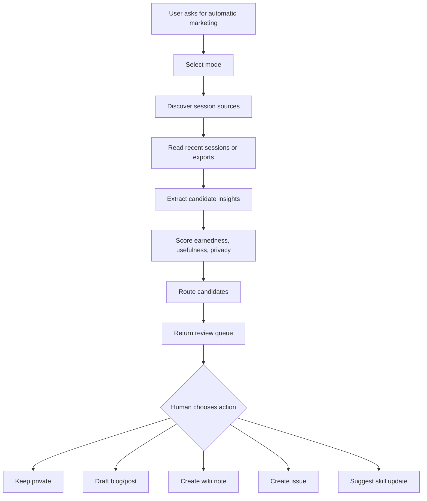

# feat: Shape an agent-session automatic marketing skill

## Overview

Create a reusable Agent Skill that helps solo builders, consultants, and small studios turn everyday agent sessions into shareable work: field notes, build-in-public updates, blog draft seeds, skill improvements, and implementation ideas.

The skill's core premise is that agent sessions are becoming the surface where real work happens. If someone already does their thinking, debugging, planning, and building inside agents, those sessions contain the raw material for automatic marketing. The skill should scan recent agent-session history, identify earned insights, apply privacy and quality filters, and return a human-approved queue of shareable artifacts.

This is not an auto-posting or content-spam skill. It is a `share your work` assistant that notices useful learning from real work and asks the user what to keep, draft, or publish.

## Source Conversation Summary

This plan comes from a working thesis developed in `lpl-obsidian` on 2026-05-25:

- `wiki/concepts/chat-native-knowledge-utilities.md`
- `wiki/concepts/agent-native-blogging.md`
- `wiki/concepts/voice-native-agent-work-sessions.md`

Key thesis from the conversation:

> Real work produces real lessons. The agent watches the work surface, finds the lessons, and helps the human share them.

The user framed this as `automatic marketing`: if a solo person or studio does real work in agent sessions, the agent can see the false starts, decisions, solved problems, and reframings. Instead of asking the human to invent content later from a blank page, the skill can prompt them with the useful things they already learned.

The Austin Kleon / build-in-public connection matters. The product value is not merely summarization. It is making `share your work` easier because the work surface already contains rich source material.

---

## Problem Statement

People who work deeply with AI agents are creating valuable material inside chat sessions:

- debugging paths;
- rejected approaches;
- design tradeoffs;
- product framings;
- source syntheses;
- operational lessons;
- explanations that would help others;
- ideas for new tools or skills.

Most of that disappears. The final code, note, or answer survives, but the reasoning trail and teachable moments are buried in local session stores, terminal scrollback, or vendor-specific history. Later, when the builder tries to market their work, they must remember what happened and reconstruct why it mattered.

This creates a capture problem, not just a writing problem. The work already produced marketing material; the system failed to notice it while it was fresh.

## Product Thesis

Agent sessions are becoming a primary work substrate. Therefore, session history can become a marketing and knowledge-compounding substrate.

For solo builders and studios, this creates a new loop:

1. Do real work inside agent sessions.
2. Let a skill mine recent sessions for earned insights.
3. Review a ranked queue of shareable artifacts.
4. Approve drafts, notes, or issues.
5. Publish or archive with source provenance.

The skill should make distribution a byproduct of doing the work, while keeping the human in control of taste, privacy, and final publication.

## Target Users

Primary users:

- solo technical founders who build in agent sessions;
- consultants and small studios who want to share credible work-in-progress;
- developer educators who want field notes from real implementation work;
- agent-heavy operators who want their session history to compound into memory, blog posts, and improved workflows.

Secondary users:

- teams using shared coding agents who want internal lessons-learned digests;
- skill authors who want to improve skills based on repeated session patterns;
- product marketers who want evidence-backed build logs without shadowing every engineer.

## Scope

### In Scope For V1

- A reusable skill under `skills/agent-session-marketing/SKILL.md`.
- A platform-agnostic workflow for scanning recent agent sessions.
- An OpenCode-first adapter because OpenCode local session history/database is the motivating near-term surface.
- Documented adapter slots for Claude Code, Cursor, Codex, and generic file-based chat exports.
- A ranked `shareable insight queue` output.
- Privacy and sensitivity review before any public-facing draft is suggested.
- Draft-only outputs for blog posts, build notes, short posts, and wiki notes.
- A human approval gate before anything external is posted or published.
- Eval prompts that test whether the skill finds earned insights without leaking private details.

### Deferred To Follow-Up Work

- Direct posting to X, LinkedIn, Substack, Ghost, WordPress, or other public channels.
- Voice review and spoken publish approval.
- Fully automated scheduled runs.
- Browser UI for reviewing insight queues.
- Cross-machine session aggregation.
- Team/shared workspace permission model.
- Deep integrations with specific blog frameworks.
- Automatic skill self-modification based on mined session failures.

### Outside This Skill's Identity

- Generic AI content generation from invented topics.
- Growth hacking or engagement-bait generation.
- Publishing without explicit human approval.
- Mining private sessions for third parties.
- Replacing a user's judgment about what is worth saying.

---

## Proposed Skill Name And Positioning

Recommended skill name:

`agent-session-marketing`

Description draft:

> Mine recent AI agent sessions for earned insights, build-in-public updates, blog seeds, reusable lessons, and skill improvements. Use when the user wants automatic marketing from real work, a daily share-your-work digest, or a queue of publishable ideas from OpenCode, Claude Code, Cursor, Codex, or exported chat histories.

Alternate names considered:

- `automatic-marketing` - clear but too broad and could imply spam.
- `share-your-work` - emotionally strong but less agent/session-specific.
- `session-miner` - technically accurate but underplays marketing value.
- `earned-marketing` - strategically strong but less obvious as a skill trigger.

Recommendation: use `agent-session-marketing` for clarity and searchability. Use `earned automatic marketing` as the thesis phrase inside the skill.

---

## Skill Behavior Model

The skill should operate in five stages:

1. Detect intent and choose mode.
2. Discover available session sources.
3. Extract candidate insights.
4. Score, filter, and route candidates.
5. Return a human-reviewable queue with next actions.

### Supported Modes

The skill should support these modes from the beginning:

| Mode | Trigger Examples | Output |
|---|---|---|
| Daily digest | "What should I share from today?" | Ranked digest of 3-7 insights |
| Blog seeds | "Find blog post ideas from my sessions" | Draft briefs with titles, thesis, source trail |
| Build-in-public updates | "What did I build today worth sharing?" | Short-post candidates |
| Lessons learned | "What did we learn this week?" | Internal learning notes |
| Skill improvements | "What failed repeatedly in my agents?" | Suggested skill/instruction improvements |
| Issue queue | "Turn useful ideas into issues" | Backlog-ready implementation ideas |

V1 should default to `daily digest` when the user asks broadly.

### Output Destinations

The skill should route each candidate to one or more suggested destinations:

| Destination | Use When |
|---|---|
| `keep-private` | Useful but sensitive or not externally valuable |
| `wiki-note` | Durable concept, source synthesis, or personal learning |
| `blog-seed` | Enough thesis and evidence for a draft post |
| `short-post` | One sharp lesson or build-in-public update |
| `issue` | Implementation-worthy tool/product idea |
| `skill-update` | Repeated failure or workflow improvement |
| `discard` | Low-signal, too private, or generic |

---

## Platform Adapter Strategy

The skill should not assume one agent platform forever. It should define a simple adapter contract so each environment can expose sessions differently.

### Adapter Contract

Each adapter should answer:

- Where are sessions stored?
- What time range is available?
- What metadata exists: timestamp, repo, title, cwd, model, agent, tool calls?
- Can the skill cite source session IDs or file paths?
- Can the skill safely read full content, or only summaries/exported text?
- Are there known privacy hazards in this source?

### Initial Adapter Priority

1. `opencode-local` - primary V1 adapter because the user explicitly called out the OpenCode database and local session visibility.
2. `claude-code-local` - likely file-based local transcripts or project session logs, depending on installation.
3. `cursor-local` - likely workspace/application history, with higher uncertainty and more privacy caution.
4. `codex-local` - local session/export support depending on harness.
5. `generic-export` - user provides `.json`, `.md`, `.txt`, or copied transcript files.

The V1 skill should document how to proceed when an adapter is unavailable: ask the user to point at a session export or history directory rather than pretending the source exists.

### Platform Optimization Principles

- Prefer local session stores over cloud APIs when possible.
- Never upload raw sessions externally by default.
- Preserve source references without copying entire private conversations into public drafts.
- Treat each platform's data model as unstable; keep adapters small and defensive.
- Provide graceful fallback to manual export.

---

## Candidate Insight Taxonomy

The skill should look for earned insight types, not generic summaries.

### High-Value Candidate Types

| Type | Signal | Example Output |
|---|---|---|
| Debugging lesson | Error, failed attempts, root cause, fix | "We learned why X fails under Y" |
| Product framing | Repeated reframing, thesis, user problem | "Agent sessions as work surface" |
| Implementation pattern | Reusable technical decision | "Adapter contracts beat hard-coded session paths" |
| Workflow improvement | Repeated friction or better process | "Daily digest should be queue-first, not auto-post" |
| Tool idea | New utility emerges from work | "Voice review loop for mined insights" |
| Teaching explanation | Clear explanation created in chat | "Why automatic marketing differs from content spam" |
| Anti-pattern | Something tried and rejected | "Don't start with auto-publishing" |
| Source synthesis | External idea connected to user's work | "Dan Shipper's paradox implies supervision surfaces" |

### Low-Value Or Reject Types

- generic progress summaries;
- private client details;
- raw transcripts;
- model hallucinations without evidence;
- motivational quotes detached from work;
- shallow `top 5 lessons` formats;
- anything whose value comes only from novelty, not usefulness.

---

## Scoring Rubric

Each candidate insight should be scored before being shown.

Recommended dimensions, each 1-5:

| Dimension | Question |
|---|---|
| Earnedness | Did this come from real work, not generic brainstorming? |
| Specificity | Is there a concrete problem, context, or example? |
| Reusability | Would someone else learn a transferable lesson? |
| Novelty | Is there a non-obvious angle or useful reframing? |
| Evidence | Can the session/source trail support the claim? |
| Audience fit | Does it match the user's public positioning or customers? |
| Privacy safety | Can it be shared without exposing sensitive details? |
| Publish readiness | Is it close to a post, or only a rough note? |

Recommended routing rule:

- Show candidates with strong earnedness and reusability even if publish readiness is low.
- Never recommend public sharing when privacy safety is low.
- Route strong but sensitive candidates to `keep-private` or `wiki-note`.
- Prefer 3-7 high-quality candidates over a long list.

---

## Privacy And Safety Model

The skill's reputation depends on not leaking private work.

### Sensitive Categories

The skill should flag or suppress:

- client names and identifying details;
- credentials, tokens, API keys, environment values;
- private URLs and internal documents;
- personal information;
- unreleased product details;
- customer data;
- legal, financial, or employment-sensitive information;
- private emotional or interpersonal context;
- anything marked confidential or proprietary.

### Required Safety Gates

- Public-facing drafts must include a `Privacy review` section.
- Source references should cite session IDs, dates, or local filenames without copying sensitive text.
- The skill must not post externally by default.
- The skill must ask for explicit approval before any publish/post action, even if an external posting tool is available.
- If unsure whether something is sensitive, route to private note and ask the user.

### Redaction Strategy

Use substitution patterns:

- client names -> `a client`, `a services firm`, `an internal project`;
- exact revenue or budget -> rounded ranges or omit;
- repo names -> generic project type unless public;
- private Slack or Linear references -> `a project thread`, `an issue`;
- raw error with secrets -> paraphrased failure mode.

---

## Output Contract

The skill should always return a structured queue.

Recommended default output:

```md
# Agent Session Marketing Digest - <date or range>

## Source Coverage
- Platforms scanned:
- Time range:
- Sessions reviewed:
- Coverage gaps:
- Privacy posture:

## Top Shareable Insights

### 1. <insight title>
- Suggested route: `blog-seed` | `short-post` | `wiki-note` | `issue` | `skill-update` | `keep-private`
- Why it matters:
- Source trail:
- Earnedness:
- Privacy risk: `low` | `medium` | `high`
- Draft angle:
- Recommended next action:

## Draftable Artifacts
- Blog seeds:
- Short-post candidates:
- Internal notes:
- Issues / skill updates:

## Not Recommended For Sharing
- <item> — <reason>

## Questions For Human Taste
- <question>
```

The skill should avoid markdown tables in chat contexts where they render poorly. In repository docs, tables are acceptable.

---

## High-Level Technical Design

This illustrates the intended approach and is directional guidance for review, not implementation specification. The implementing agent should treat it as context, not code to reproduce.



### Adapter Boundary

The core skill should separate source discovery from insight judgment:

```text
Session source adapter -> normalized session bundle -> insight extractor -> scorer/router -> human-review queue
```

Normalized session bundle fields should be conceptual, not tied to one platform:

- source platform;
- session ID or stable local reference;
- timestamp range;
- project/repo if known;
- user-visible title or inferred topic;
- summary or transcript excerpt;
- tool-call summary when available;
- sensitivity flags if known.

---

## Implementation Plan

### U1. Create the core skill contract

**Goal:** Add the reusable skill entry point with triggers, thesis, supported modes, safety rules, and output contract.

**Requirements:** Advances the core ask: a skill anyone can use to mine agent sessions for automatic marketing from real work.

**Dependencies:** None.

**Files:**

- `skills/agent-session-marketing/SKILL.md`
- `README.md`

**Approach:**

Create a skill that owns the full workflow from intent detection through queue output. The skill should make its positioning explicit: earned automatic marketing, not content spam. It should trigger on phrases such as `automatic marketing`, `share my work`, `mine my sessions`, `daily agent digest`, `blog ideas from my sessions`, `what should I share from today`, and `build in public from my agent work`.

The skill should include:

- when to use;
- when not to use;
- operating principles;
- supported modes;
- platform discovery workflow;
- insight scoring rubric;
- privacy gates;
- output format;
- next-action routing.

**Patterns to follow:**

- `skills/pm-close-lessons-learned/SKILL.md` for evidence-backed lessons and source-quality language.
- `AGENTS.md` for repo rule: broadly reusable workflows, no proprietary context.

**Test scenarios:**

- Given a user asks `What should I share from today's agent sessions?`, the skill selects daily digest mode and does not ask for a blog platform first.
- Given a user asks `Post everything interesting from my sessions`, the skill refuses auto-posting and returns a review queue workflow.
- Given a user asks for generic content ideas unrelated to agent sessions or real work, the skill steers toward earned-source capture instead of inventing topics.
- Given no session source is available, the skill asks for an export/path and offers a manual transcript fallback.

**Verification:**

- Skill frontmatter is valid and description clearly triggers for automatic marketing/session mining.
- README lists the new skill under an appropriate lane or section.
- Skill can be understood without private LPL context.

### U2. Add platform adapter reference docs

**Goal:** Define how the skill connects to OpenCode, Claude Code, Cursor, Codex, and generic exports without hard-coding one platform into the core workflow.

**Requirements:** Supports the user's goal that the skill can `connect to any agent you want` and scan session histories across platforms.

**Dependencies:** U1.

**Files:**

- `skills/agent-session-marketing/references/platform-adapters.md`
- `skills/agent-session-marketing/SKILL.md`

**Approach:**

Create a reference file that defines the adapter contract and documents first-pass adapter behavior.

Adapter sections:

- `opencode-local`: local OpenCode session database or session files, discovered defensively.
- `claude-code-local`: local transcript/session locations or user-supplied exports.
- `cursor-local`: local app/workspace history where available, with privacy warnings.
- `codex-local`: local harness history or export files.
- `generic-export`: markdown, JSON, text, or copied transcripts.

Each adapter should document:

- discovery questions;
- likely source shapes;
- source-quality classification;
- provenance fields to preserve;
- privacy hazards;
- fallback behavior.

Do not claim exact paths unless verified during implementation. The plan should keep adapter docs honest: platform storage changes often, so the skill should discover and ask rather than assume.

**Patterns to follow:**

- `skills/composio/SKILL.md` and `skills/composio/rules/*.md` for progressive disclosure: core skill stays concise, detailed platform specifics live in references.

**Test scenarios:**

- Given OpenCode history is available, the skill treats it as highest-priority source and records source coverage.
- Given only exported markdown transcripts are provided, the skill uses `generic-export` instead of failing.
- Given multiple platforms are available, the skill reports which were scanned and which were skipped.
- Given a platform cannot be located, the skill labels it as unavailable rather than inventing coverage.

**Verification:**

- Reference docs describe each adapter without embedding private local paths.
- Core `SKILL.md` points to adapter reference only when source discovery is needed.

### U3. Add insight taxonomy and scoring reference

**Goal:** Give the skill a concrete judgment system for finding useful share-your-work material.

**Requirements:** Prevents generic summaries and focuses the skill on earned insights from real work.

**Dependencies:** U1.

**Files:**

- `skills/agent-session-marketing/references/insight-taxonomy.md`
- `skills/agent-session-marketing/SKILL.md`

**Approach:**

Create a reference that defines candidate types, reject types, scoring dimensions, and routing rules.

Candidate types should include:

- debugging lesson;
- product framing;
- implementation pattern;
- workflow improvement;
- tool idea;
- teaching explanation;
- anti-pattern;
- source synthesis.

The scoring system should produce concise candidate reasoning, not opaque numbers only. A useful queue item should explain why the insight is worth preserving and where it should go next.

Routing outcomes:

- `keep-private`;
- `wiki-note`;
- `blog-seed`;
- `short-post`;
- `issue`;
- `skill-update`;
- `discard`.

**Patterns to follow:**

- `skills/pm-close-lessons-learned/SKILL.md` for turning evidence into reusable learning.
- `lpl-obsidian` concept notes as source inspiration, especially `chat-native-knowledge-utilities.md`, but do not copy private vault assumptions into the public skill.

**Test scenarios:**

- Given a session with a root-cause debugging arc, the skill identifies a debugging lesson and proposes a teaching angle.
- Given a session with only routine file edits and no transferable lesson, the skill either discards it or routes it to private progress only.
- Given a session with a strong product thesis but no publish-ready prose, the skill routes to `blog-seed`, not `short-post`.
- Given a repeated agent failure pattern, the skill routes to `skill-update` rather than marketing content.

**Verification:**

- Taxonomy has enough detail for an agent to classify without inventing categories every run.
- Reject criteria are explicit enough to reduce slop.

### U4. Add privacy and publication safety rules

**Goal:** Make privacy screening and human approval first-class behavior.

**Requirements:** Ensures automatic marketing does not leak private session data or publish without consent.

**Dependencies:** U1, U3.

**Files:**

- `skills/agent-session-marketing/references/privacy-and-publication-safety.md`
- `skills/agent-session-marketing/SKILL.md`

**Approach:**

Create safety guidance covering sensitive categories, redaction patterns, source provenance, and approval gates.

The skill should require:

- privacy risk on every candidate;
- explicit approval before public posting;
- no raw transcript dumping into public drafts;
- redaction when client/customer/project details are not public;
- `keep-private` routing for ambiguous sensitivity;
- clear distinction between draft generation and publication.

Include guidance for public channels:

- blog draft: acceptable after privacy review;
- X/LinkedIn draft: acceptable after privacy review;
- direct external post: not allowed in V1 unless the user explicitly invokes a separate connected-tool workflow and confirms final copy;
- internal wiki note: allowed when stored locally and not externally shared.

**Patterns to follow:**

- `AGENTS.md` rule to keep proprietary orchestration and private integrations out of the repo.

**Test scenarios:**

- Given a candidate includes a client name, the skill flags privacy risk and suggests a redacted version.
- Given a candidate includes a token or secret-looking string, the skill suppresses public draft generation and warns the user.
- Given the user asks to publish directly, the skill requires final copy confirmation.
- Given a useful but sensitive lesson exists, the skill routes it to `keep-private` or internal note.

**Verification:**

- Safety reference can be applied independently of platform adapter.
- Skill output contract includes privacy posture and source coverage.

### U5. Add output templates for digest, blog seed, short post, and issue

**Goal:** Make the skill immediately useful by giving it concrete artifact formats.

**Requirements:** Supports the user's desire for `boom boom` conversion from work to shareable outputs while preserving review gates.

**Dependencies:** U1, U3, U4.

**Files:**

- `skills/agent-session-marketing/references/output-templates.md`
- `skills/agent-session-marketing/SKILL.md`

**Approach:**

Define templates for:

- daily digest;
- shareable insight queue;
- blog seed brief;
- short-post draft;
- wiki note suggestion;
- implementation issue;
- skill-update suggestion.

Each template should include source trail and privacy review. Blog seeds should not pretend to be finished essays; they should include title options, thesis, proof, outline, and missing context.

Short-post drafts should prioritize specificity and field-note tone over generic advice.

Issue outputs should be implementation-ready enough to hand to a planning skill later, but not over-specified.

**Patterns to follow:**

- Existing PM skill output contracts in `skills/pm-*`.
- `skills/pm-monitor-status/SKILL.md` style of concise, decision-ready output if additional examples are needed during implementation.

**Test scenarios:**

- Given three strong candidates, the skill returns a digest with ranked insights and clear next actions.
- Given a blog-worthy candidate, the skill returns a blog seed with thesis, evidence, outline, and privacy notes.
- Given a short-post candidate, the skill drafts concise copy and labels it as draft only.
- Given an implementation idea, the skill returns an issue-style summary with problem, value, scope, and next step.

**Verification:**

- Templates are copyable and easy for agents to fill.
- Templates keep source/provenance visible without exposing raw transcripts.

### U6. Add eval scenarios for quality, safety, and routing

**Goal:** Create lightweight evaluation coverage so the skill can be tested against slop, leakage, and misrouting.

**Requirements:** Ensures the skill is useful to anyone, not only tailored to one user's current workflow.

**Dependencies:** U1-U5.

**Files:**

- `evals/agent-session-marketing/README.md`
- `evals/agent-session-marketing/cases.md`
- `evals/agent-session-marketing/rubric.md`

**Approach:**

Define representative cases rather than private session data. Cases should include synthetic transcript snippets that test:

- strong debugging lesson;
- product thesis conversation;
- sensitive client context;
- generic low-signal session;
- repeated skill failure;
- multiple platform source coverage;
- user asks for auto-posting;
- user asks for daily digest.

Rubric should score:

- earnedness detection;
- relevance of insight;
- privacy handling;
- routing quality;
- output usefulness;
- refusal/confirmation behavior for publishing.

**Patterns to follow:**

- `evals/` existing repository structure.

**Test scenarios:**

- Given a sensitive transcript, the expected output flags risk and does not draft public copy.
- Given a generic transcript, the expected output avoids forcing a content angle.
- Given an earned implementation lesson, the expected output includes source trail, lesson, and route.
- Given a request to auto-post, the expected output requires approval.

**Verification:**

- Eval cases are generic and contain no client-specific data.
- Rubric makes it clear what good and bad outputs look like.

### U7. Document future scheduler and publisher integrations

**Goal:** Preserve the bigger product direction without putting risky automation in V1.

**Requirements:** Captures the user's vision of daily scanning, agent-native blogging, and platform-optimized distribution.

**Dependencies:** U1-U6.

**Files:**

- `skills/agent-session-marketing/references/future-integrations.md`
- `docs/plans/2026-05-25-feat-agent-session-automatic-marketing-skill-plan.md`

**Approach:**

Document follow-up integrations:

- scheduled daily run;
- Obsidian/vault note creation;
- blog draft creation for static sites;
- GitHub issue creation;
- Linear issue creation;
- X/LinkedIn draft generation;
- voice review loop;
- skill improvement loop;
- multi-agent session aggregation.

Keep this out of the core V1 skill to avoid scope creep. The V1 skill should be valuable as an on-demand miner before automation is scheduled.

**Patterns to follow:**

- `skills/composio/SKILL.md` for connected-tool workflows when external posting or issue creation is eventually added.

**Test scenarios:**

- Test expectation: none for runtime behavior because this unit documents future integrations only.

**Verification:**

- Future integrations are clearly marked as deferred.
- V1 implementer is not asked to build schedulers or external posting.

---

## Suggested V1 Skill Structure

```text
skills/agent-session-marketing/
  SKILL.md
  references/
    platform-adapters.md
    insight-taxonomy.md
    privacy-and-publication-safety.md
    output-templates.md
    future-integrations.md
evals/agent-session-marketing/
  README.md
  cases.md
  rubric.md
```

This creates a useful skill without adding scripts yet. If implementation discovers that session discovery needs reusable helpers, add scripts in a follow-up plan after the adapter assumptions are verified.

---

## V1 User Experience

### Example 1: Daily Digest

User:

> What should I share from today's agent sessions?

Skill behavior:

1. Detects daily digest mode.
2. Discovers available session sources.
3. Scans today's sessions or asks for path/export if needed.
4. Returns 3-7 ranked candidates.
5. Recommends next actions: blog seed, short post, wiki note, issue, keep private.

Expected output shape:

```md
# Agent Session Marketing Digest - 2026-05-25

## Source Coverage
- Platforms scanned: OpenCode local history
- Time range: today
- Sessions reviewed: 4
- Coverage gaps: Claude Code not configured
- Privacy posture: public drafts require review

## Top Shareable Insights

### 1. Agent sessions are the new work surface
- Suggested route: `blog-seed`
- Why it matters: This reframes automatic marketing around real work capture.
- Source trail: OpenCode session <local-ref>, 2026-05-25
- Earnedness: High
- Privacy risk: Low
- Draft angle: "Automatic marketing is what happens when your agent can see the work."
- Recommended next action: Draft a 700-word field note.
```

### Example 2: Privacy-Sensitive Work

User:

> Find shareable content from my client debugging session.

Skill behavior:

1. Scans the session.
2. Detects client-identifying details.
3. Extracts generalizable debugging lesson.
4. Redacts client specifics.
5. Routes to draft only with medium/high privacy warning.

### Example 3: Skill Improvement

User:

> What did my agents keep messing up this week?

Skill behavior:

1. Selects skill improvement mode.
2. Looks for repeated corrections, tool misuse, and workflow friction.
3. Returns candidate instruction/skill updates with evidence.
4. Does not frame these as public marketing unless there is a broader lesson.

---

## Key Technical Decisions

### Decision 1: Queue-first, not auto-publish

The skill should produce a review queue before drafts or external actions. This preserves trust and keeps the skill aligned with earned marketing rather than spam.

### Decision 2: OpenCode-first, adapter-general

OpenCode is the first concrete source because the user named its local DB/session history. However, the skill should be written around a platform adapter contract so it can support Claude Code, Cursor, Codex, and generic exports.

### Decision 3: Insight extraction before content drafting

The skill should first identify the lesson, why it matters, source trail, and privacy posture. Drafting comes after routing. This avoids turning every session into forced content.

### Decision 4: Public output is always draft-only in V1

V1 may create suggested copy, blog briefs, or post drafts, but should not publish externally. External posting can be a separate connected-tool workflow after explicit confirmation.

### Decision 5: Generic reusable skill, not LPL-only workflow

The skill should be useful to anyone with agent sessions. References to Lola's vault and LPL strategy inform this plan but should not be required for the public skill.

---

## Risks And Mitigations

| Risk | Why It Matters | Mitigation |
|---|---|---|
| Content slop | Skill could produce generic posts from thin material | Score earnedness and reject low-signal candidates |
| Privacy leaks | Session histories contain sensitive data | Privacy risk on every candidate, redaction, no auto-posting |
| Platform brittleness | Session storage paths change | Adapter docs, defensive discovery, generic export fallback |
| Over-scoping | Scheduler, blog engine, and posting integrations could balloon V1 | Keep V1 queue-first and draft-only |
| User overwhelm | Daily digests could become too long | Cap default output at 3-7 candidates |
| False confidence | Agent may overstate source coverage | Require source coverage section and gaps |
| Brand mismatch | Drafts may not sound like the user | Treat drafts as starting points and include human taste questions |

---

## Success Criteria

V1 is successful when:

- A user can ask for a daily agent-session marketing digest and receive useful candidates.
- The skill can operate from OpenCode session history or a generic exported transcript.
- Every candidate includes source trail, why it matters, suggested route, and privacy risk.
- The skill reliably refuses or gates auto-publishing.
- Low-signal sessions are not forced into content.
- Sensitive sessions are routed privately or redacted.
- Eval cases demonstrate strong insight selection and safe privacy behavior.

## Future Product Expansion

Once V1 works on demand, the broader product could become a full automatic marketing system:

1. Scheduled daily miner scans sessions every evening.
2. Insight queue appears in Slack, email, Obsidian, or a local dashboard.
3. User approves one item.
4. Agent expands it into a blog draft or short post.
5. Voice review reads it aloud and accepts interruption.
6. Agent publishes through an agent-native blog or creates a queued social draft.
7. Published artifact links back to private source trail.
8. Lessons also feed internal wiki and skill improvements.

This is the larger loop:

```text
Do work in agents -> mine sessions -> identify earned insight -> review with human -> publish/share/archive -> improve future work
```

---

## Open Questions For Implementation

- What OpenCode session store locations and schemas are stable enough to document?
- Should V1 include a small discovery script, or keep source discovery purely instruction-based?
- Should the skill write digest files to disk by default, or only return chat output unless asked?
- Where should generated drafts go when the user has no blog configured?
- Should there be a standard `.agents/marketing-context.md` file for audience, voice, and approved public topics?
- Should the skill integrate with `pm-close-lessons-learned`, or remain separate because it is broader than project closeout?
- What is the best default cadence for future scheduled runs: daily, workday-only, or weekly digest?

## Recommended Next Step

Implement U1-U5 first as a documentation-only skill. Then test manually against a small set of exported sessions before adding evals and platform-specific helpers.

The first useful version should answer one question well:

> What did I do in agent sessions today that is worth keeping, sharing, or turning into a tool?
