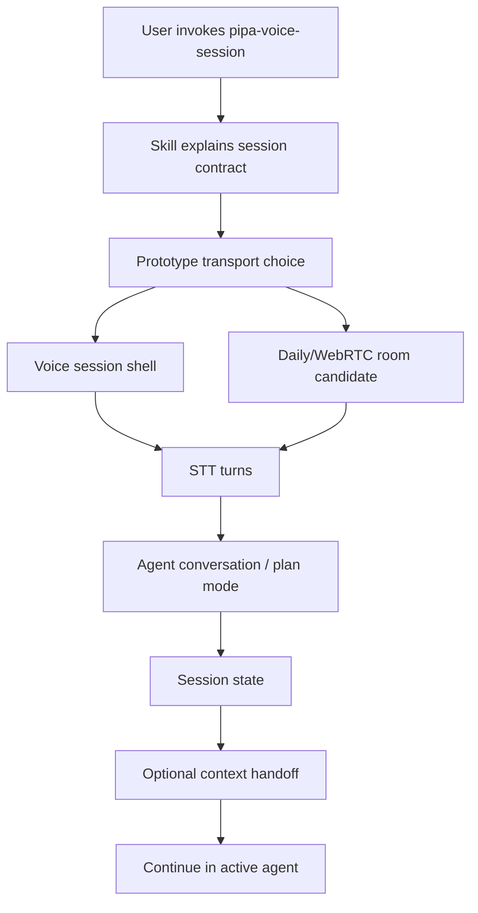

# feat: Add Pipa Voice Session Skill

## Summary

Build `pipa-voice-session` as a standalone Pipa breakout skill that starts a voice session with the user's agent. V1 should define the skill contract and prototype the session launch/voice loop; planning or context handoff is a mode of use, not a separate workflow the skill imposes.

---

## Problem Frame

The shaping doc defines the product as a voice session with Pipa, not a video meeting product. The implementation should let a user enter a voice session with the same agent context they are already working with. In practice, that may mean talking to the agent in plan mode to gather enough context for later execution, but the skill should not introduce a separate planning workflow.

---

## Requirements

- IR1. Add a standalone `pipa-voice-session` skill that can be invoked by phrases like “Pipa voice session,” “talk this through,” “walking work session,” and “plan this by voice” (supports origin R0-R2).
- IR2. Keep V1 scoped to starting a voice session with the user's agent; realtime voice coding, spoken permission approval, and video presence are non-goals (supports origin R2-R3 and R9).
- IR3. Define the session contract loosely: the skill starts a voice session, explains what context will be available, and supports plan-mode conversation without forcing a new planning workflow (supports origin R4-R5).
- IR4. Define a lightweight context handoff shape for sessions that end with execution intent: what was discussed, decisions, open questions, and an optional prompt to continue in the agent (supports origin R3 and R5).
- IR5. Provide a same-computer prototype path that demonstrates spoken/text-simulated input, spoken output, live transcript, and session-state updates before productionizing transport (supports origin R0-R1 and R6).
- IR6. Prototype competing transport approaches and then choose one; do not build the skill with many fallback branches up front (supports origin R6).
- IR7. Keep privacy/retention guidance minimal but honest: label when audio/transcript leaves the browser or room provider, and avoid persisting raw transcripts by default (supports origin R8).
- IR8. Update Pipa routing/readme surfaces only enough to expose the breakout skill without copying its internals into `skills/pipa/`.
- IR9. Add eval fixtures and lightweight validation for trigger routing, scope boundaries, blocker behavior, optional handoff quality, and basic privacy/retention handling.

---

## Scope Boundaries

- V1 does not build realtime voice coding or stream live OpenCode tool execution.
- V1 does not implement spoken approval for file, shell, or tool changes.
- V1 does not require video, avatar generation, Google Meet, Zoom, Teams, or customer-facing meeting bots.
- V1 does not require durable transcript retention; raw transcript/audio are transient by default unless the user explicitly saves a summary or handoff.
- V1 does not require mobile/phone joining; same-computer joining is acceptable.
- V1 should not make `pipa-audio-brief` depend on `pipa-voice-session`; audio brief can become an entry point later.

### Deferred to Follow-Up Work

- Audio brief entry point: add a `Start voice session` affordance after the core session launch/voice loop works.
- OpenCode realtime bridge: selected session, event streaming, permission mapping, and execution status narration after V1 proves session launch and optional context handoff.
- Daily/WebRTC hosted room: choose this if prototype testing shows it is the easiest reliable path for the session link.
- Browser-session and remote-machine support: test after same-computer V1 works, including SSH/browser contexts and Daily if needed.

---

## Context & Research

### Relevant Code and Patterns

- `skills/pipa-audio-brief/SKILL.md` shows the right standalone skill pattern: frontmatter trigger contract, stepwise workflow, explicit blockers, and one primary output.
- `skills/pipa-audio-brief/references/` shows how detailed workflow contracts stay out of the entry `SKILL.md`.
- `skills/pipa/SKILL.md` and `skills/pipa/references/standalone-invocation.md` show how standalone breakout workflows are routed without copying their internals into Pipa.
- `README.md` has a Breakout Skills table that should include new standalone skills when they become public.
- `skills/pipa-audio-brief/evals/trigger-eval-set.json` and `skills/pipa-audio-brief/evals/evals.json` are the closest eval patterns for triggers and behavior contracts.
- `prototypes/agent-session-shapes/` is a static prototype area. It currently compares shapes but does not include real STT, TTS, Daily, WebRTC, or backend behavior.
- `scripts/validate_skill_frontmatter.rb` is the repo’s active validation script and should pass after adding the skill.

### Institutional Learnings

- There is no `docs/solutions/` directory in this repo.
- `docs/plans/2026-05-25-001-feat-audio-brief-session-link-plan.md` reinforces the pattern of proving a useful local/product-shaped audio workflow before adding live Pipecat, hosting, persistence, or chat.
- `docs/plans/2026-05-30-001-refactor-pipa-skills-restructure-plan.md` reinforces keeping Pipa concise and reserving standalone breakout skills for product-specific or independently discoverable workflows.
- `prototypes/agent-session-shapes/PRODUCT-THREAD.md` frames the core product job as bidirectional voice work sessions, with video optional and async voice notes as a fallback rather than the main product.

### External References

- MDN `getUserMedia()`: microphone capture requires a secure context and explicit user permission.
- MDN Web Speech API: `SpeechRecognition` has limited availability and should be treated as prototype-only, while `SpeechSynthesis` is broadly available but voice quality varies by browser/OS.
- Daily audio-only and transcription docs: Daily/WebRTC is a practical fallback when browser STT/TTS is unreliable or when a hosted room/session model is needed.

---

## Key Technical Decisions

- Create `pipa-voice-session` as a standalone breakout skill: the shaping doc defines this as a product-specific primitive, and repo conventions reserve standalone skills for high-value/product-specific workflows.
- Keep the entry `SKILL.md` concise and move detailed behavior into references: this follows `pipa-audio-brief` and keeps the trigger contract easy to scan.
- Treat the first executable artifact as a prototype, not production runtime: this repo is primarily an instruction-pack repo, so `prototypes/` should compare approaches before the skill commits to one transport.
- Do not design a many-fallback skill up front: prototype browser STT/TTS, Daily/WebRTC, and any available agent/browser-session path, then pick the simplest reliable route.
- Keep the session contract workflow-light: the skill starts and frames the voice session; existing agent workflows and plan mode should do the heavy lifting.
- Make the handoff optional: when the session is used to flesh out an idea, produce a concise context summary or continuation prompt; otherwise the value is simply the live voice session.
- Default transcript retention to transient: privacy posture should not persist raw audio or full transcript unless the user/config explicitly asks for it.

---

## Open Questions

### Resolved During Planning

- Should this be one plan plus a separate OpenCode research doc? No. The shaping plan is the single source of truth; only a short future OpenCode bridge note remains in the shaping doc.
- Is V1 realtime voice coding? No. V1 starts a voice session with the user's agent; plan mode can produce a continuation prompt for later execution.
- Is video part of V1? No. Video/presence is deferred.
- Does V1 need phone/mobile support? No. Same-computer joining is acceptable.

### Deferred to Implementation

- Transport choice: implementation should test browser STT/TTS, Daily/WebRTC, and same-computer/browser-session constraints before choosing one V1 route.
- Session state persistence: implementation should choose in-memory or local storage after prototype behavior is visible, while preserving the privacy default that raw transcript/audio are not persisted.
- Handoff mechanism: if the session is used for plan mode, V1 may use a copyable continuation prompt first; automatic loading into OpenCode can follow if straightforward.

---

## Output Structure

```text
skills/pipa-voice-session/
  SKILL.md
  references/
    session-contract.md
    context-handoff.md
    transport-prototype.md
    privacy-and-retention.md
  evals/
    trigger-eval-set.json
    evals.json

prototypes/pipa-voice-session/
  index.html
  NOTES.md
  TESTING.md
```

---

## High-Level Technical Design

> *This illustrates the intended approach and is directional guidance for review, not implementation specification. The implementing agent should treat it as context, not code to reproduce.*



The key separation is that transport gets the user into a voice session, while the existing agent workflow determines what happens inside it. Browser speech, Daily/WebRTC, or a later provider can change without changing the skill's core job: start the voice session and preserve enough context to continue afterward when needed.

---

## Implementation Units

### U1. Add the voice session skill shell

**Goal:** Create the standalone skill entry point with trigger language, scope boundaries, session framing, and blocker behavior.

**Requirements:** IR1, IR2, IR3, IR7, IR8, IR9

**Dependencies:** None

**Files:**
- Create: `skills/pipa-voice-session/SKILL.md`
- Create: `skills/pipa-voice-session/evals/trigger-eval-set.json`
- Test: `skills/pipa-voice-session/evals/trigger-eval-set.json`

**Approach:**
- Position the skill as a way to enter a voice session with the user's agent, not generic TTS, audio brief generation, video meetings, or realtime voice coding.
- Include a short progress checklist similar to `pipa-audio-brief`, but keep detailed behavior in references.
- Define happy-path behavior: start session, make clear what context is available, converse, and optionally produce a continuation summary/prompt.
- Define blocked states: no chosen voice transport, mic denied, session link unavailable, or user asks for unsafe realtime voice coding.

**Patterns to follow:**
- `skills/pipa-audio-brief/SKILL.md`
- `skills/composio/SKILL.md` for setup/auth/blocker discipline

**Test scenarios:**
- Happy path: query “Pipa voice session to talk through this idea” triggers the skill.
- Happy path: query “plan this by voice” triggers the skill.
- Edge case: query “make an audio brief from this doc” does not trigger `pipa-voice-session` and remains `pipa-audio-brief` territory.
- Edge case: query “join my Zoom video call” does not trigger this skill.
- Error path: request for “voice code this live and approve changes by voice” returns scope boundary and suggests using voice to clarify direction before normal agent execution.

**Verification:**
- Frontmatter validates with the existing validator.
- Trigger eval fixtures distinguish voice planning sessions from audio briefs, video meetings, and realtime coding, and U6 validates their JSON shape.

---

### U2. Define session contract and context handoff references

**Goal:** Make the voice-session behavior concrete without imposing a new planning workflow.

**Requirements:** IR2, IR3, IR4, IR5, IR9

**Dependencies:** U1

**Files:**
- Create: `skills/pipa-voice-session/references/session-contract.md`
- Create: `skills/pipa-voice-session/references/context-handoff.md`
- Create: `skills/pipa-voice-session/evals/evals.json`
- Test: `skills/pipa-voice-session/evals/evals.json`

**Approach:**
- Define the session contract: start the session, identify the connected agent/context, support normal back-and-forth, and avoid pretending voice mode is a separate agent brain.
- Define plan mode as one usage pattern: if the user is fleshing out an idea, the agent can ask clarifying questions and produce a concise continuation summary.
- Define a lightweight handoff shape: topic, useful context gathered, decisions/preferences, open questions, and optional prompt to continue in the active agent.
- Include behavior for rambly speech: capture useful context and decisions without treating every phrase as a final instruction.

**Patterns to follow:**
- `skills/pipa/references/plan.md` for optional plan-mode output discipline.
- `skills/pipa-audio-brief/references/audio-brief-script.md` for concise spoken language guidance.

**Test scenarios:**
- Happy path: prompt with a fuzzy feature idea produces a concise continuation summary with useful context, decisions, open questions, and next prompt.
- Edge case: contradictory user preferences are surfaced as a clarification instead of silently picking one.
- Edge case: user ends early and the handoff includes explicit open questions without pretending readiness.
- Error path: generic transcript-only output fails the eval because it lacks useful context synthesis.
- Integration: generated handoff includes an optional prompt suitable for loading into another agent.

**Verification:**
- Behavioral eval fixtures cover useful session handoff output, not raw transcript summaries, and U6 validates their JSON shape.
- References are concise and linked from `SKILL.md`.

---

### U3. Prototype and choose the transport path

**Goal:** Compare practical voice-session transports and choose one route before hardening the skill around it.

**Requirements:** IR5, IR6, IR7, IR9

**Dependencies:** U1

**Files:**
- Create: `skills/pipa-voice-session/references/transport-prototype.md`
- Create: `skills/pipa-voice-session/references/privacy-and-retention.md`
- Modify: `skills/pipa-voice-session/evals/evals.json`
- Test: `skills/pipa-voice-session/evals/evals.json`

**Approach:**
- Define prototype candidates: browser STT/TTS, Daily/WebRTC audio room, and any same-computer/browser-session route that can attach to the user's agent context.
- Define what each prototype must prove: join link works, user can speak, agent/Pipa can speak back, session can carry useful context, and setup friction is acceptable.
- Keep privacy notes lightweight but honest for each candidate: whether audio/transcript may leave the machine and whether raw transcript is persisted.
- Do not encode all candidates as runtime fallback branches in the skill. The output of this unit is a chosen V1 transport direction plus documented tradeoffs.

**Patterns to follow:**
- `skills/pipa-audio-brief/references/audio-generation-and-fallbacks.md`
- `skills/pipa-audio-brief/references/local-review-bundle.md`
- `skills/pipa-audio-brief/references/here-now-publishing.md` for precise visibility/retention language.

**Test scenarios:**
- Happy path: browser voice available response labels mic/transcript handling and optional handoff retention.
- Error path: mic permission denied returns a clear blocker and fallback options.
- Error path: browser STT unavailable returns a clear degraded/fallback state.
- Error path: unchosen/unconfigured transport returns a setup blocker rather than pretending fallback exists.
- Integration: transport prototype notes compare browser, Daily/WebRTC, and same-computer/browser-session constraints.
- Integration: browser STT is labeled “browser-mediated; may use cloud STT unless verified on-device.”

**Verification:**
- Skill outputs do not present multiple fallback branches as product behavior before a V1 transport is chosen.
- Eval fixtures cover chosen transport, unconfigured transport, and basic privacy wording.

---

### U4. Build the same-computer simulation prototype

**Goal:** Demonstrate the interaction model with a local prototype before treating voice transport as production infrastructure.

**Requirements:** IR3, IR4, IR5, IR6, IR7

**Dependencies:** U2, U3

**Files:**
- Create: `prototypes/pipa-voice-session/index.html`
- Create: `prototypes/pipa-voice-session/NOTES.md`
- Create: `prototypes/pipa-voice-session/TESTING.md`
- Test: `prototypes/pipa-voice-session/TESTING.md`

**Approach:**
- Create a self-contained prototype page with mic/listen controls, transcript display, spoken Pipa response, session-state panel, end-session action, and optional handoff preview.
- Use progressive enhancement: show browser voice controls only when secure context, mic APIs, and speech APIs are available; otherwise show text simulation or fallback blocker states.
- Do not invent a production LLM/runtime bridge inside this repo. Canned prompts, deterministic simulated responses, or text simulation are acceptable for proving the UX and session-state contract.
- Keep raw transcript/audio in memory by default; do not write raw transcript to files or console logs.
- Bind local prototype to localhost by default in docs. If testing on `0.0.0.0`, require explicit testing instructions, a visible LAN warning, and a random session token or equivalent guard in the URL.
- Keep the prototype static and clearly labeled as non-production.
- Preserve current `prototypes/agent-session-shapes/` as prior exploration unless implementation chooses to consolidate it after the new prototype exists.

**Patterns to follow:**
- `prototypes/agent-session-shapes/index.html` for static prototype style and query-mode experimentation.
- `prototypes/agent-session-shapes/NOTES.md` for clearly labeling prototype status and run commands.

**Test scenarios:**
- Happy path: same-computer page opens and shows mic controls, transcript area, session-state panel, and end-session action.
- Happy path: text simulation mode can update session state and produce a handoff summary even when STT is unavailable.
- Edge case: insecure context or missing mic API shows a clear unavailable state.
- Edge case: user pauses/resumes and session state remains intact.
- Error path: browser STT unavailable does not break the page; it routes to simulation/fallback guidance.
- Integration: handoff preview uses the lightweight shape from `context-handoff.md`.
- Integration: reset/end-session clears raw transcript state while preserving only the generated handoff if the user chooses to copy/save it.

**Verification:**
- `TESTING.md` lists manual scenarios for browser voice, unavailable voice, text simulation, transcript cleanup, LAN warning, and optional handoff.
- Prototype can be served locally and reviewed without installing app dependencies.

---

### U5. Wire Pipa and repository discovery surfaces

**Goal:** Make the new skill discoverable without bloating the core Pipa skill.

**Requirements:** IR1, IR2, IR8, IR9

**Dependencies:** U1, U2, U3, U4

**Files:**
- Modify: `skills/pipa/SKILL.md`
- Modify: `skills/pipa/references/standalone-invocation.md`
- Modify: `README.md`
- Test: `skills/pipa/evals/trigger-eval-set.json`
- Test: `skills/pipa/evals/evals.json`

**Approach:**
- Add `voice session` / `talk this through by voice` routing to the standalone workflow list only after the standalone contract is present.
- Keep `skills/pipa/SKILL.md` as a router: route to the breakout skill, do not duplicate voice-session internals.
- Add README breakout entry with a concise description focused on starting a voice session with Pipa.
- Add/adjust Pipa evals so generic text planning stays in Pipa, audio briefs stay in `pipa-audio-brief`, and explicit voice sessions route to `pipa-voice-session`.

**Patterns to follow:**
- `skills/pipa/SKILL.md` connected workflow routing.
- `skills/pipa/references/standalone-invocation.md` standalone invocation pattern.
- `README.md` Breakout Skills table.

**Test scenarios:**
- Happy path: “Pipa voice session” routes to the standalone skill.
- Happy path: “Talk this plan through with me by voice” routes to the standalone skill.
- Edge case: “Pipa plan this project” stays inside Pipa planning and does not force voice.
- Edge case: “Create an audio brief” continues to route to `pipa-audio-brief`.
- Integration: README install/discovery list includes `pipa-voice-session` only once.

**Verification:**
- Pipa routing docs mention the standalone breakout without copying its workflow.
- README and evals agree on the skill name and trigger boundary.

---

### U6. Add eval fixture validation
**Goal:** Add lightweight validation for the new skill and eval fixture files so repository checks cover the new artifacts.

**Requirements:** IR9

**Dependencies:** U1, U2, U3, U5

**Files:**
- Create: `scripts/validate_skill_evals.rb`
- Modify: `.github/workflows/validate-skill-frontmatter.yml`
- Test: `scripts/validate_skill_frontmatter.rb`
- Test: `scripts/validate_skill_evals.rb`

**Approach:**
- Add a small JSON-shape validator for `skills/*/evals/trigger-eval-set.json` and `skills/*/evals/evals.json` so new eval fixtures are not silently malformed.
- Keep the validator structural only. It should not try to judge LLM output quality or become a full eval runner.
- Extend CI to run both frontmatter and eval-fixture validation.

**Patterns to follow:**
- `scripts/validate_skill_frontmatter.rb` for lightweight repo validation style.
- `.github/workflows/validate-skill-frontmatter.yml` for existing CI shape.

**Test scenarios:**
- Happy path: valid existing eval fixture files pass validation.
- Error path: missing required trigger eval fields fail validation with file path and case context.
- Error path: malformed JSON fails validation clearly.
- Edge case: skills without evals are skipped rather than failed.

**Verification:**
- Existing skill frontmatter validation still passes.
- Eval fixture validation passes for current and newly added eval files.
- CI runs both validators.

---

## System-Wide Impact

- **Interaction graph:** New `pipa-voice-session` stands alone, with optional routing from `skills/pipa/` and future optional entry points from `pipa-audio-brief`.
- **Error propagation:** The skill should block clearly on unavailable audio transport, unsupported browser speech, missing fallback configuration, or privacy uncertainty.
- **State lifecycle risks:** Raw transcript/audio should be transient by default; any handoff summary is optional durable state.
- **API surface parity:** No production runtime API is required in this repo for V1; the prototype can simulate voice/session behavior. If Daily/WebRTC becomes necessary, runtime code should likely live outside the public skill instruction pack.
- **Integration coverage:** Eval coverage must prove routing boundaries across Pipa, audio brief, and voice session.
- **Unchanged invariants:** `pipa-audio-brief` remains async artifact-to-listening-page. `pipa-voice-session` should not take over generic audio brief or generic text-planning requests.

---

## Risks & Dependencies

| Risk | Mitigation |
|------|------------|
| Browser `SpeechRecognition` is unreliable, unavailable, or cloud-backed. | Treat browser STT as prototype-only, label browser-mediated STT honestly, and document Daily/WebRTC fallback. |
| The skill becomes a new planning workflow instead of a voice session. | Keep the session contract loose; plan mode is optional and existing agent workflows remain authoritative. |
| Scope creeps back into realtime voice coding. | Keep OpenCode realtime bridge in deferred/future sections; V1 handoff happens after session. |
| Privacy posture is unclear. | Require transport-specific privacy/retention labels before mic or provider use. |
| LAN prototype exposure leaks transcript/plan state. | Default to localhost; require explicit LAN mode warning and tokenized access for `0.0.0.0` testing. |
| Core Pipa router becomes bloated. | Route to standalone skill and keep internals in `skills/pipa-voice-session/references/`. |
| Prototype implies production readiness. | Label prototype status in `NOTES.md` and keep production transport decisions behind the transport spike. |

---

## Documentation / Operational Notes

- Do not bump skill versions during draft/branch work; version changes happen when finalizing for merge.
- Run the existing skill frontmatter validator after adding `skills/pipa-voice-session/SKILL.md`.
- If the prototype is run on `0.0.0.0`, label it as explicit testing mode, warn that LAN users may access the page, and use tokenized session URLs or equivalent guarding. Secure-context requirements may still block mic access outside localhost/HTTPS.
- If Daily/WebRTC is selected, document room expiry, link access, recording/transcription defaults, required environment variables, and provider visibility/retention before making it the default path.

---

## Sources & References

- **Origin document:** `docs/plans/2026-06-02-feat-pipa-voice-session-shaping.md`
- Related prototype: `prototypes/agent-session-shapes/`
- Existing breakout skill pattern: `skills/pipa-audio-brief/SKILL.md`
- Pipa router: `skills/pipa/SKILL.md`
- Standalone invocation pattern: `skills/pipa/references/standalone-invocation.md`
- Repo validation: `scripts/validate_skill_frontmatter.rb`
- Browser mic docs: https://developer.mozilla.org/en-US/docs/Web/API/MediaDevices/getUserMedia
- Web Speech API docs: https://developer.mozilla.org/en-US/docs/Web/API/Web_Speech_API
- Daily audio-only docs: https://docs.daily.co/guides/products/audio-only
