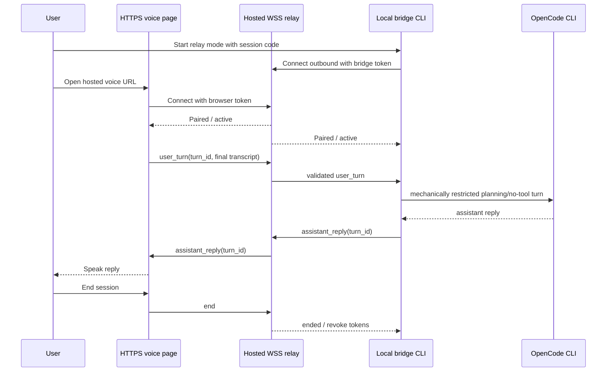
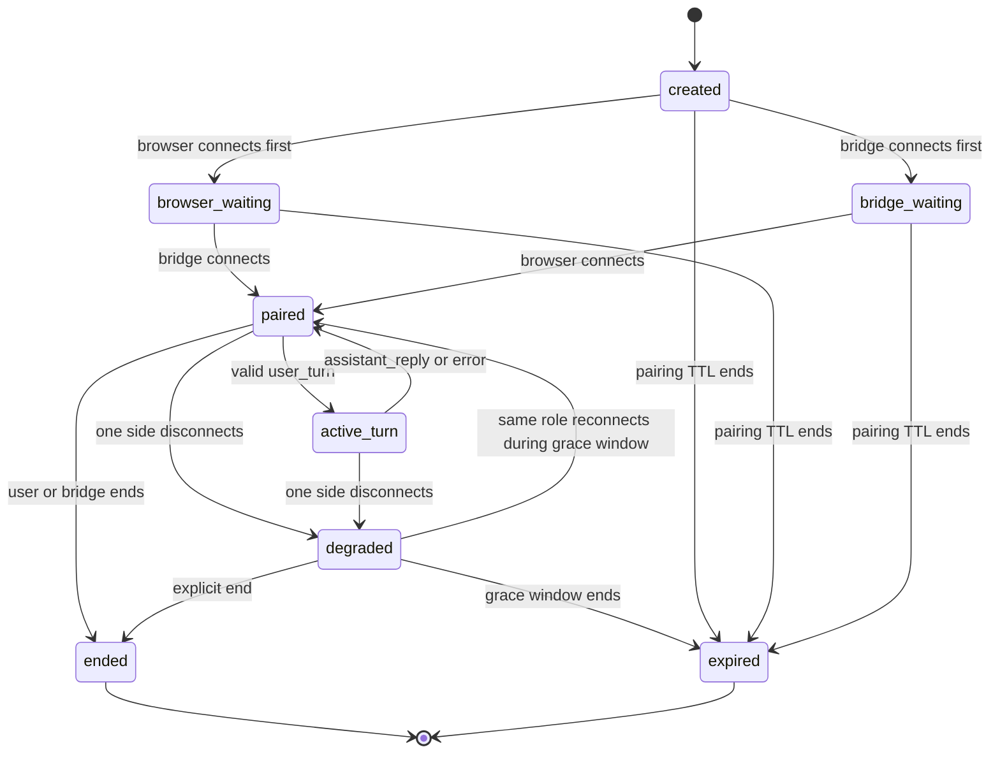

# feat: Add Pipa Voice Session Hosted Relay

## Summary

Add a hosted relay path for `pipa-huddle-beta` so users can enter a voice session with an agent from anywhere, including sandboxed development environments where localhost is not the user’s normal workspace. The actual voice loop already works through local and ngrok testing; this plan preserves that logic and puts a stable hosted HTTPS/WSS relay in front of it. Browser voice turns still route to the user's active OpenCode bridge, replies come back to the browser, raw audio/transcript are not retained by the relay, and the voice session remains a conversational planning/work-session layer rather than realtime voice coding or spoken permission approval.

---

## Problem Frame

The current `pipa-huddle-beta` implementation works: local testing and ngrok testing both prove that the browser voice loop, OpenCode bridge, and spoken replies are the right core shape. The gap is access. The user often works from sandboxed environments rather than a local development machine, so they need an easy hosted link that can enter a voice session with the active agent from anywhere. Browser microphone and speech APIs also require localhost or HTTPS, so plain HTTP sandbox/LAN links can load the page while still blocking voice capture.

A hosted relay solves the practical access problem: open a stable HTTPS voice page, connect the active bridge outbound, and keep the already-working turn loop intact. It also removes localhost as the trust boundary, so anyone with a valid browser link could send turns toward an agent unless pairing, session lifecycle, message validation, and safety modes are explicit.

This plan adds the hosted relay as a transport layer around the existing local bridge. It does not turn this skills repo into a full account system, meeting platform, command runner, or persistent transcript service.

---

## Requirements

- HR1. Provide the hosted relay as the primary path for sandbox/remote use: a stable HTTPS/WSS voice link that does not require ngrok account setup.
- HR1a. Preserve the existing local and ngrok-tested voice loop as the implementation foundation and fallback/dev paths.
- HR2. Pair the browser page and local bridge through outbound-only WebSocket connections; the relay must never connect inbound to the user's machine.
- HR3. Use short-lived, high-entropy, role-separated session credentials for browser and bridge participants, with explicit expiry, revocation, and reconnect behavior.
- HR4. Keep the hosted relay narrow: route schema-validated voice turn, status/error, interrupt/end, and assistant reply messages only; do not expose arbitrary command/RPC execution.
- HR5. Add a mechanically enforceable local bridge safety boundary for hosted sessions; if OpenCode cannot be run in no-tool/read-only/planning-only mode, hosted relay mode must fail closed instead of relying on prompt instructions alone.
- HR6. Preserve the privacy default by component: no raw audio, raw transcript, message body, local path, or token retention in relay logs by default; disclose that OpenCode local session history may persist final text turns according to local OpenCode behavior; durable user-facing output remains an optional synthesized handoff.
- HR7. Show accurate user-facing status and blocker states for waiting, pairing, active turns, reconnecting, expired sessions, duplicate joins, and ended sessions.
- HR8. Document deployment/configuration boundaries for a branded hosted relay without making `skills/pipa/` duplicate relay internals.
- HR9. Extend evals and validation coverage for hosted relay triggers, privacy blockers, token/session lifecycle, and no spoken approval behavior.

---

## Scope Boundaries

- Hosted relay is the primary path for sandbox/remote use. Local `127.0.0.1` remains supported for same-machine development and fallback testing.
- Hosted relay is not realtime voice coding, live OpenCode event streaming, or spoken permission approval.
- Hosted relay does not persist raw audio/transcript/message bodies by default.
- Hosted relay does not add user accounts, billing, dashboards, organization membership, or a full backend product surface in this repo.
- Hosted relay does not make `pipa-audio-brief` depend on `pipa-huddle-beta`.
- Hosted relay does not promise browser STT is on-device; it must disclose browser/vendor speech behavior.

### Deferred to Follow-Up Work

- Branded production deployment at `voice.usepipa.com` or `voice.usepippa.com`, including DNS, final domain copy, and production monitoring.
- Account-owned relay sessions, team access controls, usage analytics, or admin dashboards.
- End-to-end encryption between browser and local bridge if relay trust becomes a product requirement.
- Provider-backed audio rooms such as Daily/WebRTC if browser STT/TTS remains unreliable for target users.
- Audio brief entry points that launch a live voice session from a listening page.

---

## Context & Research

### Relevant Code and Patterns

- `skills/pipa-huddle-beta/scripts/start-voice-session.mjs` is the current local bridge and UI. It already serves the browser page, captures speech, calls `opencode run`, speaks replies, and supports `--public ngrok`.
- `skills/pipa-huddle-beta/references/transport-prototype.md` defines the current V1 transport contract, LAN warning, ngrok mode, and non-goals.
- `skills/pipa-huddle-beta/references/privacy-and-retention.md` defines required labels and the transient raw audio/transcript default.
- `skills/pipa-huddle-beta/references/session-contract.md` defines the product boundary: voice session as an interaction layer, not a separate agent brain or realtime coding runtime.
- `skills/pipa-audio-brief/references/here-now-publishing.md` provides the closest existing pattern for precise hosted/public link wording: return one URL, label visibility/expiry honestly, and avoid calling unlisted public links private.
- `scripts/validate_skill_evals.rb` validates skill eval fixture structure and should cover any new eval cases added for hosted relay behavior.

### Institutional Learnings

- There is no `docs/solutions/` directory in this repo.
- `docs/plans/2026-06-03-001-feat-pipa-huddle-beta-plan.md` keeps realtime OpenCode tool streaming, permission mapping, and execution narration deferred; this hosted relay plan should preserve that boundary.
- `docs/plans/2026-06-02-feat-pipa-huddle-beta-shaping.md` frames the product as a voice work session, not a transport-first video or meeting product.
- `prototypes/pipa-huddle-beta/NOTES.md` reinforces the LAN/public exposure guardrail: default to localhost and require tokenized/unguessable access before sharing.

### External References

- MDN `getUserMedia()` and Secure Contexts: microphone access requires secure contexts; HTTPS/WSS or localhost are required for reliable browser voice capture.
- MDN Web Speech API: `SpeechRecognition` has limited browser availability and may use browser/vendor cloud services; this must be disclosed.
- OWASP Session Management Cheat Sheet: use high-entropy opaque session identifiers with scoped lifecycle and revocation.
- OWASP WebSocket Security Cheat Sheet: validate origin, authenticate sockets, enforce schema/size/rate limits, and prefer WSS.
- OWASP OS Command Injection Defense Cheat Sheet: do not turn untrusted user text into shell commands; subprocesses must use explicit argv and allowlisted behavior.
- Node.js HTTP docs and `ws` project docs: a small Node relay can use one HTTP(S) server, explicit WebSocket upgrade routing, ping/pong heartbeat, message size limits, and compression disabled unless load-tested.

---

## Key Technical Decisions

- Treat hosted relay as a transport wrapper, not a product rewrite. The browser voice UI and local OpenCode bridge remain the core loop.
- Use outbound-only connections for both participants: browser to relay and local bridge to relay. The relay never needs inbound access to the user's machine.
- Use role-separated tokens: a browser credential cannot connect as the bridge, and a bridge credential cannot connect as the browser.
- Keep tokens out of query strings when possible. Prefer one-time code exchange or URL fragments for browser bootstrap, with `Referrer-Policy: no-referrer` on the hosted page.
- Make hosted sessions planning/safe-mode by default. The local bridge must use a mechanical no-tool/read-only/planning-only OpenCode restriction if available; if not, hosted relay mode must fail closed instead of sending remote browser turns into normal `opencode run`.
- Keep the relay incapable of command expansion. It routes only known message types and never accepts generic `exec`, RPC, shell, or OpenCode control messages.
- Log lifecycle/security metadata only. Do not log token values, transcript/message bodies, local paths, or raw audio references.
- Keep implementation skill-local for the prototype: add small scripts and reference docs under `skills/pipa-huddle-beta/`. Production hosting can later move to a dedicated service repo if account/storage/ops needs grow.

---

## Open Questions

### Resolved During Planning

- Should the hosted relay replace the working local loop? No. Hosted relay should wrap and preserve the working local/ngrok-proven loop; localhost remains supported for same-machine development and fallback testing.
- Should hosted relay rely on ngrok? No. Ngrok remains a quick experimental mode, but the relay should support branded HTTPS without user ngrok setup.
- Should hosted relay support realtime voice coding or spoken approvals? No. It should explicitly block that scope.
- Should the relay store transcripts to support handoff? No. Handoff should be synthesized by the bridge/browser path and only saved when the user asks.

### Deferred to Implementation

- Final hosting provider choice for the branded relay domain.
- Final user-facing copy for branded production domain once the domain is chosen.

---

## Output Structure

```text
skills/pipa-huddle-beta/
  scripts/
    relay-protocol.mjs
    relay-protocol.test.mjs
    start-voice-session.mjs
    start-hosted-relay.mjs
  references/
    hosted-relay.md
    transport-prototype.md
    privacy-and-retention.md
  evals/
    evals.json
    trigger-eval-set.json

package.json
package-lock.json
.github/workflows/validate-skill-frontmatter.yml
```

The exact helper/module split may change during implementation, but the public contract should remain: one local bridge script, one hosted relay script or deployable entry point, a hosted-relay reference, and eval coverage for behavior boundaries.

---

## High-Level Technical Design

> *This illustrates the intended approach and is directional guidance for review, not implementation specification. The implementing agent should treat it as context, not code to reproduce.*



### Relay Session State



---

## Implementation Units

### U1. Document the hosted relay contract

**Goal:** Define the hosted relay as the primary sandbox/remote transport path with security, privacy, lifecycle, and deployment boundaries.

**Requirements:** HR1, HR2, HR3, HR4, HR5, HR6, HR7, HR8

**Dependencies:** None

**Files:**
- Create: `skills/pipa-huddle-beta/references/hosted-relay.md`
- Modify: `skills/pipa-huddle-beta/references/transport-prototype.md`
- Modify: `skills/pipa-huddle-beta/references/privacy-and-retention.md`
- Modify: `skills/pipa-huddle-beta/SKILL.md`
- Test: `skills/pipa-huddle-beta/evals/evals.json`

**Approach:**
- Define when hosted relay is appropriate: sandboxed development, remote browser access, public HTTPS/browser voice testing, or branded session links.
- Document the session lifecycle: create, waiting for browser, waiting for bridge, paired, active turn, degraded, expired, ended, revoked.
- Document token expectations: role-separated, short-lived, high-entropy, revocable, and not logged.
- Document exact non-goals: no remote arbitrary command channel, no spoken approval, no raw transcript retention.
- Add user-facing blocker wording for missing relay URL, expired link, wrong-role token, unknown privacy posture, and confidential work where local mode is safer.

**Patterns to follow:**
- `skills/pipa-huddle-beta/references/transport-prototype.md`
- `skills/pipa-huddle-beta/references/privacy-and-retention.md`
- `skills/pipa-audio-brief/references/here-now-publishing.md`

**Test scenarios:**
- Happy path: hosted relay setup text explains browser HTTPS page plus local outbound bridge connection.
- Edge case: confidential client/security/legal work asks before creating or using a hosted link.
- Error path: missing hosted relay configuration returns a blocker instead of falling back to an imaginary provider.
- Error path: request for spoken tool approval through hosted relay is rejected as outside scope.
- Integration: `SKILL.md` presents hosted relay as the sandbox/remote path while preserving localhost as same-machine fallback.

**Verification:**
- The hosted relay reference is linked from `SKILL.md` and does not duplicate internals into `skills/pipa/`.
- Privacy copy explicitly distinguishes local, ngrok, and hosted relay modes.

---

### U2. Add relay dependency, test harness, and protocol boundary

**Goal:** Make the Node relay implementation testable in this repo, then create a small relay protocol boundary for session state, role validation, token handling, message schemas, and safe direction rules.

**Requirements:** HR2, HR3, HR4, HR6, HR7

**Dependencies:** U1

**Files:**
- Create: `package.json`
- Create: `package-lock.json`
- Modify: `.github/workflows/validate-skill-frontmatter.yml`
- Create: `skills/pipa-huddle-beta/scripts/relay-protocol.mjs`
- Create: `skills/pipa-huddle-beta/scripts/relay-protocol.test.mjs`
- Test: `package.json`
- Test: `skills/pipa-huddle-beta/scripts/relay-protocol.test.mjs`

**Approach:**
- Introduce the minimum Node dependency strategy required for a deployable WSS relay. Use `ws` unless implementation discovers a simpler maintained WebSocket server path.
- Add a `node --test` path for relay protocol tests and wire CI to run it alongside the existing Ruby validators.
- Keep protocol logic separated from the server entry point so validation, state transitions, and token lifecycle can be tested without network sockets.
- Define session bootstrap concretely: a session creation path returns a browser URL/token and a bridge token/command; tokens are random opaque values, stored hashed in memory with role, session, expiry, and revocation state.
- Define allowed roles: `browser` and `bridge`.
- Define allowed browser-to-bridge message types: `user_turn`, `interrupt`, `end`.
- Define allowed bridge-to-browser message types: `assistant_reply`, `status`, `error`, `end`.
- Require `turn_id` for user turns and replies so reconnect/retry behavior can avoid duplicate sends.
- Reject unknown message types, binary messages, oversized payloads, wrong-direction messages, missing role/session fields, and command-like RPC shapes.
- Enforce one active connection per role, reconnect only during a short grace window, and revoke tokens on explicit end, expiry, or invalid takeover attempts.

**Patterns to follow:**
- `skills/pipa-huddle-beta/scripts/start-voice-session.mjs` for small Node script style.
- `scripts/validate_skill_evals.rb` for simple standard-library validation style.

**Test scenarios:**
- Happy path: valid browser `user_turn` with `turn_id` passes schema validation.
- Happy path: valid bridge `assistant_reply` with matching `turn_id` passes schema validation.
- Happy path: session creation returns separate browser and bridge credentials with different roles and expiries.
- Edge case: duplicate `turn_id` is rejected or reported as already handled.
- Error path: `{ "type": "exec", "command": "rm -rf" }` is rejected and never forwarded.
- Error path: bridge token used with browser role is rejected.
- Error path: browser token used with bridge role is rejected.
- Error path: replaying a token after session end or revocation is rejected.
- Error path: oversized transcript payload is rejected with a clear error.
- Error path: binary payload is rejected.

**Verification:**
- Protocol tests can run without network access or a hosted deployment.
- CI runs the protocol tests in addition to frontmatter and eval validation.
- The relay implementation has a single source of truth for allowed message types and role directions.

---

### U3. Add the hosted relay server prototype

**Goal:** Add a small deployable relay entry point that serves the HTTPS voice page and routes WSS messages between one browser and one local bridge per session.

**Requirements:** HR1, HR2, HR3, HR4, HR6, HR7

**Dependencies:** U2

**Files:**
- Create: `skills/pipa-huddle-beta/scripts/start-hosted-relay.mjs`
- Modify: `package.json`
- Modify: `skills/pipa-huddle-beta/scripts/relay-protocol.test.mjs`
- Test: `package.json`
- Test: `skills/pipa-huddle-beta/scripts/relay-protocol.test.mjs`

**Approach:**
- Serve a health endpoint and a relay voice page that derives `wss://` from the HTTPS page origin in hosted deployment and uses development-safe local URLs only in local test mode.
- Provide a session creation endpoint or CLI-created session package that returns only the artifacts needed to connect the browser and bridge roles.
- Accept WebSocket connections only on expected paths and reject unknown upgrades.
- Validate browser `Origin` against configured allowed origins.
- Disable WebSocket compression unless implementation proves it is needed.
- Track one active browser and one active bridge per session; reject duplicates unless replacing the same role during a short reconnect grace window.
- Add ping/pong heartbeat, idle timeout, absolute session timeout, pairing TTL, and cleanup on disconnect/end.
- Add abuse controls: per-session and per-IP connection/message rate limits, one in-flight `user_turn` per session, bounded queues, invalid-message strike limits, and max concurrent session caps.
- Redact tokens and message bodies from all logs.

**Patterns to follow:**
- `skills/pipa-huddle-beta/scripts/start-voice-session.mjs` for script ergonomics and quiet UI language.
- `skills/pipa-audio-brief/references/here-now-publishing.md` for single-link status wording and truthful expiry labels.

**Test scenarios:**
- Happy path: browser connects first, bridge connects later, session reaches paired state.
- Happy path: bridge connects first, browser connects later, session reaches paired state.
- Edge case: second browser tab with same token is rejected or receives explicit “session already open” state.
- Edge case: browser refresh during grace window reconnects without creating a second active browser.
- Error path: expired pairing token returns “start a new session.”
- Error path: unknown upgrade path is rejected.
- Error path: invalid origin is rejected.
- Error path: repeated invalid frames close the socket before they can consume unbounded resources.
- Error path: rapid valid turns are rate-limited and only one turn can be in flight.
- Error path: session idle timeout closes both sockets and drops relay buffers.

**Verification:**
- Relay can be run locally for development and exposes no unauthenticated generic pipe.
- Lifecycle logs contain session state transitions without transcripts, token values, or local filesystem paths.

---

### U4. Add outbound hosted-relay mode to the local bridge

**Goal:** Let the existing local bridge connect outbound to a hosted relay and forward validated voice turns to OpenCode only when a mechanical no-tool/planning safety boundary is available.

**Requirements:** HR1, HR2, HR4, HR5, HR7

**Dependencies:** U2, U3

**Files:**
- Modify: `skills/pipa-huddle-beta/scripts/start-voice-session.mjs`
- Modify: `skills/pipa-huddle-beta/scripts/relay-protocol.test.mjs`
- Test: `skills/pipa-huddle-beta/scripts/relay-protocol.test.mjs`

**Approach:**
- Add explicit relay mode configuration, such as hosted relay URL plus bridge token/session code via flags or environment variables.
- Print the repo directory, OpenCode session behavior, hosted safe-mode status, and relay session id before connecting.
- Connect outbound over WSS and authenticate as the bridge role.
- Forward only schema-valid `user_turn` messages to OpenCode and return only `assistant_reply`, `status`, or `error` messages.
- Verify an OpenCode no-tool, read-only, planning-only, or equivalent restricted mode before enabling hosted relay turns. If no mechanical enforcement exists, hosted relay mode must return a blocker rather than calling normal `opencode run`.
- Use prompt copy only as explanatory defense-in-depth after mechanical restrictions are in place; do not treat prompt instructions as the safety boundary.
- Preserve local mode behavior for `node skills/pipa-huddle-beta/scripts/start-voice-session.mjs` without hosted flags.

**Patterns to follow:**
- Existing `opencode run` invocation in `skills/pipa-huddle-beta/scripts/start-voice-session.mjs`.
- `skills/pipa-huddle-beta/references/session-contract.md` for short spoken replies and no invented execution progress.

**Test scenarios:**
- Happy path: relay mode receives a valid `user_turn`, calls OpenCode once, and returns an `assistant_reply` with the same `turn_id`.
- Edge case: duplicate `turn_id` after reconnect is not sent to OpenCode twice.
- Edge case: bridge disconnect mid-turn reports uncertain delivery and does not auto-replay without confirmation.
- Error path: hosted relay tries an unknown message type and the bridge rejects it without invoking OpenCode.
- Error path: hosted relay mode cannot find an enforceable restricted OpenCode mode and fails closed with setup guidance.
- Error path: spoken approval or live file/shell execution requests are rejected with scope wording and no OpenCode tool/file/shell action.
- Integration: local mode still serves `127.0.0.1` and works without relay configuration.

**Verification:**
- Hosted mode cannot be started accidentally; it requires explicit relay configuration.
- Bridge status clearly states which repo/session it can affect and that hosted mode is not live tool approval.

---

### U5. Update the hosted voice page states and privacy labels

**Goal:** Make the browser UI explain hosted relay state clearly while preserving the quiet one-orb visual language.

**Requirements:** HR1, HR6, HR7

**Dependencies:** U3, U4

**Files:**
- Modify: `skills/pipa-huddle-beta/scripts/start-voice-session.mjs`
- Modify: `skills/pipa-huddle-beta/scripts/start-hosted-relay.mjs`
- Test: `skills/pipa-huddle-beta/evals/evals.json`

**Approach:**
- Reuse the current `Ready`, `Listening`, `Sending to OpenCode`, `Speaking`, and `Blocked` states.
- Add hosted-specific states: `Waiting for local bridge`, `Paired`, `Reconnecting`, `Expired`, and `Ended`.
- Show privacy text before use: browser speech may use browser/vendor services, relay forwards text turns/replies without retaining bodies by default, bridge logs should not retain raw turns, and OpenCode local session history may persist final text turns according to local behavior.
- Keep text input as accessibility/debug fallback, still routed through the same validated turn path.
- Ensure browser sends only final transcript turns, not interim speech fragments, across the relay.

**Patterns to follow:**
- Current UI in `skills/pipa-huddle-beta/scripts/start-voice-session.mjs`.
- `DESIGN.md` and `PRODUCT.md` for quiet, document-like, one-primary-action product feel.

**Test scenarios:**
- Happy path: hosted page waits for bridge and then transitions to paired/listening once the bridge connects.
- Edge case: browser speech unavailable keeps text fallback available without pretending voice works.
- Edge case: second browser tab receives a clear blocked/already-open state.
- Error path: expired link shows “start a new session” and prevents recording.
- Error path: reconnect grace expires and UI moves to ended/expired without sending stale turns.
- Integration: privacy label appears before the first voice turn.
- Integration: relay logs inspected after a test session contain lifecycle events only, not tokens, transcript text, local paths, or message bodies.

**Verification:**
- Hosted UI remains simple and does not add dashboard-like controls.
- State labels are understandable without reading developer logs.

---

### U6. Extend eval and documentation coverage

**Goal:** Make hosted relay behavior discoverable and regression-resistant in the skill docs and eval fixtures.

**Requirements:** HR8, HR9

**Dependencies:** U1, U5

**Files:**
- Modify: `skills/pipa-huddle-beta/evals/evals.json`
- Modify: `skills/pipa-huddle-beta/evals/trigger-eval-set.json`
- Test: `skills/pipa-huddle-beta/evals/evals.json`
- Test: `skills/pipa-huddle-beta/evals/trigger-eval-set.json`

**Approach:**
- Add behavior evals for hosted relay setup blockers, privacy wording, expired session handling, no raw transcript retention, and no spoken approval.
- Add trigger cases for “hosted voice session,” “relay-backed voice session,” and “talk to my agent from another browser,” while keeping Zoom/Meet/audio-brief cases out of scope.
- Keep hosted relay documentation skill-local. Do not update README or Pipa router docs unless implementation discovers an existing stale route.
- Do not bump `metadata.version` or `VERSIONS.md` during draft/branch work.

**Patterns to follow:**
- `skills/pipa-huddle-beta/evals/evals.json`
- `scripts/validate_skill_evals.rb`
- `README.md` Breakout Skills table

**Test scenarios:**
- Happy path: “start a hosted Pipa voice session” triggers `pipa-huddle-beta`.
- Happy path: hosted setup response includes local bridge, HTTPS relay, expiry, and retention wording.
- Edge case: “make an audio brief” still belongs to `pipa-audio-brief`.
- Error path: “approve OpenCode changes by voice through hosted relay” returns a scope blocker.
- Error path: missing relay configuration returns a blocker with next action.

**Verification:**
- Eval fixtures pass structural validation.
- Router docs remain concise and authoritative details stay inside `skills/pipa-huddle-beta/`.

---

### U7. Add minimum deployment hardening guidance

**Goal:** Make the relay deployable behind HTTPS/WSS without implying that branded production DNS and account infrastructure are part of this repo change.

**Requirements:** HR1, HR3, HR6, HR8

**Dependencies:** U3

**Files:**
- Modify: `skills/pipa-huddle-beta/references/hosted-relay.md`
- Modify: `skills/pipa-huddle-beta/references/privacy-and-retention.md`
- Test: `skills/pipa-huddle-beta/evals/evals.json`

**Approach:**
- Document the minimum deployment checklist: TLS/WSS only, HSTS on branded domains, explicit allowed origins/hosts, secrets from managed env/secret store, no filesystem persistence for session data, and emergency kill switch for session creation.
- Document platform logging requirements: no request URL/token/header/body logging, redacted authorization fields, no APM/crash body capture, sanitized validation errors, and lifecycle-only structured app logs.
- Document operational signals: active sessions, rejected handshakes, invalid frames, rate-limit events, reconnects, expiries, and relay disabled state.
- Keep DNS/domain/monitoring provider selection deferred, but make clear that any public deployment must satisfy this checklist before user-facing use.

**Patterns to follow:**
- `skills/pipa-audio-brief/references/here-now-publishing.md` for truthful visibility/expiry wording.
- `skills/pipa-huddle-beta/references/privacy-and-retention.md` for component-specific retention labeling.

**Test scenarios:**
- Happy path: hosted setup docs list required env vars and deployment safety checks before public use.
- Error path: unknown platform logging or retention behavior blocks hosted use for sensitive topics.
- Error path: relay disabled/kill-switch state prevents new sessions and returns a clear blocker.
- Integration: privacy eval distinguishes relay non-retention from OpenCode local history behavior.

**Verification:**
- Hosted relay docs are specific enough for a deployer to know what must be configured before exposing a public URL.
- The plan still defers branded domain production rollout while allowing a relay prototype to run behind a compliant HTTPS host.

---

## Risks & Dependencies

- **Remote prompt-to-local-agent risk:** Hosted browser input can drive a local agent if the bridge is too permissive. Mitigate with explicit relay mode, mechanical no-tool/planning enforcement, message schema allowlists, no spoken approvals, and clear local bridge consent/status.
- **Token leakage risk:** URL query tokens can leak through logs, history, referrers, and screenshots. Mitigate with one-time code exchange or URL fragments, redaction, short TTLs, and `Referrer-Policy: no-referrer`.
- **Privacy promise drift:** Relay logs, platform logs, crash reports, or local OpenCode history can retain more than users expect. Mitigate with component-specific privacy copy, no message-body relay logging, lifecycle-only logs, size-limited structured events, platform log checks, and explicit debug opt-in if ever added.
- **Browser support risk:** `SpeechRecognition` remains limited and browser-mediated. Mitigate with feature detection, text fallback, honest copy, and later provider-backed room exploration if needed.
- **Repo boundary risk:** A hosted relay can grow into a product backend. Mitigate by keeping this implementation a small prototype/deployable relay and deferring accounts/storage/admin surfaces.
- **Dependency risk:** A WebSocket package is likely needed because Node does not provide a browser-compatible WebSocket server API in the same way browsers provide clients. Keep dependencies minimal, pinned in `package-lock.json`, and covered by the Node test workflow.

---

## Documentation / Operational Notes

- Hosted relay configuration should use environment variables, not hardcoded domains or secrets.
- Candidate env vars: `PIPA_VOICE_RELAY_PORT`, `PIPA_VOICE_RELAY_PUBLIC_BASE_URL`, `PIPA_VOICE_RELAY_ALLOWED_ORIGINS`, `PIPA_VOICE_RELAY_SESSION_TTL_SECONDS`, `PIPA_VOICE_RELAY_IDLE_TIMEOUT_SECONDS`, `PIPA_VOICE_RELAY_MAX_MESSAGE_BYTES`, and `PIPA_VOICE_RELAY_LOG_LEVEL`.
- Local bridge relay mode should use explicit flags or env vars for relay URL/session code and should print the active repo directory before connecting.
- Production deployment should terminate TLS at the platform/load balancer and expose HTTPS/WSS only.
- The relay health endpoint should prove process liveness without exposing session metadata.
- Cleanup should invalidate tokens and drop in-memory buffers on end, expiry, process shutdown, or disconnect grace timeout.
- Any public deployment should verify that platform/proxy/APM logs do not contain tokens, transcripts, local paths, or message bodies after a test session.

---

## Success Metrics

- A user can start a relay session without ngrok when the relay is deployed behind a compliant HTTPS/WSS host.
- A local bridge can connect outbound to the relay and pair with the browser without inbound networking.
- Expired, duplicate, wrong-role, and disconnected session states fail closed with understandable UI copy.
- Relay and platform logs contain no raw transcript/audio/message bodies, local file paths, or token values.
- Hosted relay scope blockers and mechanical bridge restrictions prevent spoken approvals and arbitrary command/RPC messages.
- Localhost mode remains unchanged for the default launch command.
